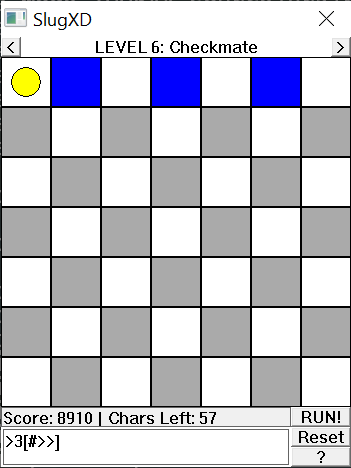

# SlugXD



A simple slug game made with [XDPW](https://github.com/vtereshkov/xdpw).

To control the slug you use different controls:

| Control | Description                                      |
| :-----: | ------------------------------------------------ |
|   >     | Move the slug right                              |
|   <     | Move the slug left                               |
|   ^     | Move the slug up                                 |
|   v     | Move the slug down                               |
|   #     | Paint!                                           |
| 2 to 9  | Loop next action                                 |
|   [     | Begin scope                                      |
|   ]     | End scope                                        |

Numbers 2 to 9 can be used to loop next action, like `2>` will move slug right twice.
And doing `2[>#]` will move slug right twice and paint =P

Special thanks to Vasily Tereshkov for creating XDPW and making Win32 wrapper example. Made for his 39th birthday. Happy birthday!

# Levels

Levels are stored in `Levels.txt`. Be careful editing it: it might hang the program because `ReadLn` is expecting input when there's not, the format is simple though:

```
Repeat:
Title
Field Map 7x7
Newline
```

# Solutions

Solutions are in `Solutions.txt`.